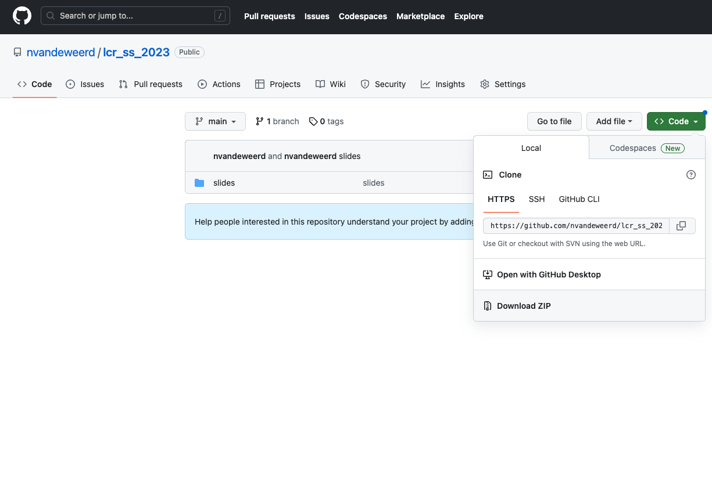
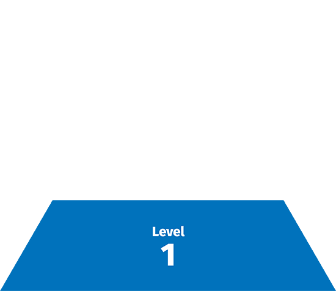
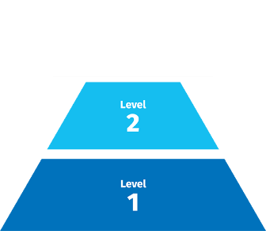
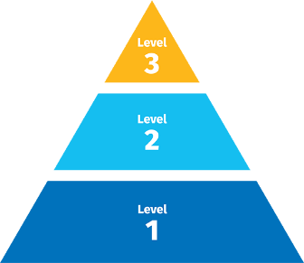

```{r setup, include=FALSE}
options(htmltools.dir.version = FALSE)
knitr::opts_chunk$set(echo = FALSE, warning = FALSE, error = FALSE, 
                      message = FALSE, fig.align = "center")
library(officedown); library(officer)
library(tidyverse)
library(here);
library(kableExtra)

def_text <- fp_text(font.size = 12, font.family = "Montserrat")

# set_flextable_defaults(font.family = "Montserrat", 
#                        font.size = 12,
#                        digits = 0,
#                        border.color = "#000000",
#                        padding.bottom = 1,
#                        padding.top = 1,
#                        padding.left = 3,
#                        padding.right = 1)


```

```{r xaringanExtra, echo=FALSE}
xaringanExtra::use_xaringan_extra(c("tile_view"))
```

```{r load_refs, include=FALSE, cache=FALSE, eval = FALSE }
library(RefManageR)
BibOptions(check.entries = FALSE,
           bib.style = "authoryear",
           cite.style = "text",
           style = "markdown",
           hyperlink = FALSE,
           dashed = FALSE,
           no.print.fields = c("url", "doi", "issn", "isbn"))
#bib <- RefManageR::ReadBib(here("references.bib"), check = TRUE)
#save(bib, file = here("presentations", "bib.rdata"))
load(here("defence", "bib.rdata"))
```

```{r xaringan-banner, echo=FALSE}
xaringanExtra::use_banner(
  bottom_center = "github.com/nvandeweerd/lcr_ss_2023",
  exclude = "title-slide"
)
```


## All materials and sides available on [GitHub](github.com/nvandeweerd/lcr_ss_2023)

.pull-left[
```{r}

```

1. Click on .content-box-green[ `< > Code`].
2. `Download ZIP` to download all files.
]

.pull-right[
```{r, out.width="80%"}

```
]


---


## Agenda


---

## How this workshop will work

.pull-left[
.large[**Level 1.**] Basic webtools (beginner)

]


.pull-right[
```{r}

```

]

---

## How this workshop will work

.pull-left[
.large[**Level 1.**] Basic webtools (beginner)  
.large[**Level 2.**] SketchEngine (intermediate)

]


.pull-right[
```{r}

```

]

---

## How this workshop will work

.pull-left[
.large[**Level 1.**] Basic webtools (beginner)  
.large[**Level 2.**] SketchEngine (intermediate)  
.large[**Level 3.**] R (advanced)  

]


.pull-right[
```{r}

```

]

---

# .huge[Q]


## .huge[.green[.center[& Eh?]]]

---

## `r icons::fontawesome("book")` Further reading 

Newman, J., & Cox, C. (2021). Corpus annotation. In A practical handbook of corpus linguistics (pp. 25–48). Springer. https://doi.org/10.4324/9780429269035-7

van Rooy, B. (2015). Annotating learner corpora. In S. Granger, G. Gilquin, & F. Meunier (Eds.), The Cambridge handbook of learner corpus research (pp. 79–106). Cambridge University Press. https://doi.org/10.1017/CBO9781139649414.005


